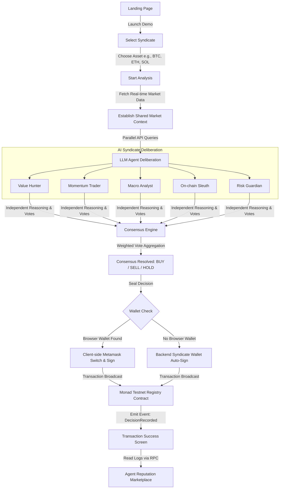

# Penguin Protocol

> **A decentralized AI Investment Syndicate where specialized autonomous agents debate, vote, and permanently seal consensus decisions on the Monad Blockchain.**

[](https://testnet.monadscan.com)
[](https://nextjs.org)
[](https://tailwindcss.com)
[](https://book.getfoundry.sh/)

---

## Table of Contents
- [What is Penguin Protocol?](#what-is-penguin-protocol)
- [Monad Integration and Ecosystem Benefits](#monad-integration-and-ecosystem-benefits)
- [Product Flow & Architecture](#product-flow--architecture)
- [AI Syndicate & Agent Frameworks](#ai-syndicate--agent-frameworks)
- [Consensus Engine](#consensus-engine)
- [Smart Contract Specification](#smart-contract-specification)
- [Reputation Marketplace](#reputation-marketplace)
- [Tech Stack](#tech-stack)
- [Environment Configuration](#environment-configuration)
- [Local Setup & Run](#local-setup--run)
- [Smart Contract Deployment](#smart-contract-deployment)

---

## What is Penguin Protocol?

Real-world hedge funds and investment firms don't rely on a single voice. They form investment committees composed of macro economists, risk management officers, fundamental analysts, and momentum traders who debate, verify details, and vote. 

**Penguin Protocol** replicates this professional consensus mechanism in a decentralized web application. Instead of trusting a single, opaque AI black-box (`User → ChatGPT → Trade`), users interact with a **Syndicate of five specialized AI Agents**. 

These agents:
1. Receive identical real-time market data and on-chain metrics (**Shared Market Context**).
2. Reason independently using custom, non-overlapping analytical frameworks.
3. Vote with a self-calibrated confidence score.
4. Reach an aggregate consensus (**BUY**, **SELL**, or **HOLD**).
5. Record the final decision **immutably on Monad** (securing transparency, historical record, and agent reputation).

---

## Monad Integration and Ecosystem Benefits

### How Monad is Used in the Application
1. **Immutability of Consensus Decisions**: Instead of keeping AI consensus off-chain where it could be tampered with or retroactively altered, every completed deliberation of the five agents is permanently recorded. The application broadcasts a transaction to the `recordDecision` function on `PenguinRegistry.sol` on the Monad Testnet.
2. **Decentralized Reputation Tracking**: Rather than relying on a centralized database to log agent success rates, the system leverages Monad's transaction history. By querying the contract logs for `DecisionRecorded` events, the app calculates running reputation and historical statistics trustlessly.
3. **Flexible Transaction Routing**: The web application supports two modes of interaction with Monad. When a browser wallet (such as MetaMask) is connected, it requests the user to switch network to Monad Testnet (Chain ID 10143) and sign client-side. If no wallet is detected, the Next.js API automatically routes the request to a backend signer configured with a `MONAD_PRIVATE_KEY` to ensure a smooth demo experience.

### Why Monad is Beneficial for This Use Case
1. **Performance at Scale**: Running an AI investment committee creates a continuous stream of decisions. Monad's high-speed execution (10,000 TPS) ensures that transactions are processed immediately, preventing backlogs when multiple syndicates are deliberating simultaneously.
2. **Ultra-Low Fees**: Logging detailed voting metrics on-chain on standard EVM networks can become cost-prohibitive. Monad's fee optimizations allow frequent recording of state changes, making persistent audit trails economically viable.
3. **AI and Web3 Confluence**: As AI agents assume greater autonomy, verifying their history, decisions, and performance becomes a critical security challenge. Monad acts as a scalable truth layer, proving what the agents analyzed, what they voted for, and when they reached consensus.
4. **Developer-Friendly EVM Compatibility**: By maintaining full bytecode compatibility, the project utilizes the exact same developer tooling (Foundry, Solidity 0.8.20, and Viem clients) to deploy and interact with Monad, shortening deployment cycles for complex Web3 integrations.

---

## Product Flow & Architecture

The application is structured to optimize trust. Decisions are fully explainable, transparent, and publicly auditable.

### 1. High-Level Flow Chart



### 2. Detailed Technical Workflow

```
[ User ]                      [ Frontend Next.js ]            [ Next.js API Routes ]            [ CoinGecko / F&G ]           [ Gemini / Groq / OpenRouter ]           [ Monad Testnet ]
   │                                  │                                  │                                   │                                  │                                  │
   │ 1. Launch & Select Syndicate     │                                  │                                   │                                  │                                  │
   ├─────────────────────────────────>│                                  │                                   │                                  │                                  │
   │                                  │                                  │                                   │                                  │                                  │
   │ 2. Select Asset & "Analyze"      │                                  │                                   │                                  │                                  │
   ├─────────────────────────────────>│ 3. POST /api/analyze             │                                   │                                  │                                  │
   │                                  ├─────────────────────────────────>│                                   │                                  │                                  │
   │                                  │                                  │ 4. Get Prices & Indices           │                                  │                                  │
   │                                  │                                  ├──────────────────────────────────>│                                  │                                  │
   │                                  │                                  │ 5. Return Market Data             │                                  │                                  │
   │                                  │                                  │<──────────────────────────────────┤                                  │                                  │
   │                                  │                                  │                                   │                                  │                                  │
   │                                  │                                  │ 6. Parallel Agent Calls (Gemini/Groq)                                │                                  │
   │                                  │                                  ├─────────────────────────────────────────────────────────────────────>│                                  │
   │                                  │                                  │ 7. Return Decisions, Confidence & Reasoning                           │                                  │
   │                                  │                                  │<─────────────────────────────────────────────────────────────────────┤                                  │
   │                                  │                                  │                                   │                                  │                                  │
   │                                  │ 8. Stream Responses & Animate    │                                   │                                  │                                  │
   │                                  │<─────────────────────────────────┤                                   │                                  │                                  │
   │                                  │                                  │                                   │                                  │                                  │
   │                                  │ 9. Calculate Consensus Index     │                                   │                                  │                                  │
   │                                  ├───────────┐                      │                                   │                                  │                                  │
   │                                  │<──────────┘                      │                                   │                                  │                                  │
   │                                  │                                  │                                   │                                  │                                  │
   │ 10. Trigger "Record On-Chain"    │                                  │                                   │                                  │                                  │
   ├─────────────────────────────────>│ 11. Send Contract Write          │                                   │                                  │                                  │
   │                                  ├──────────────────────────────────┼───────────────────────────────────┼──────────────────────────────────┼─────────────────────────────────>│
   │                                  │                                  │                                   │                                  │                                  │ (Metamask client write or
   │                                  │                                  │ 12. POST /api/record (Fallback)   │                                  │                                  │  backend transaction fallback)
   │                                  │                                  ├───────────────────────────────────┼──────────────────────────────────┼─────────────────>│               │
   │                                  │                                  │                                   │                                  │                  │ 13. Mine      │
   │                                  │                                  │                                   │                                  │                  │     Block     │
   │                                  │                                  │                                   │                                  │                  ├───────────┐   │
   │                                  │                                  │                                   │                                  │                  │<──────────┘   │
   │                                  │                                  │ 14. Return tx hash                │                                  │                  │               │
   │                                  │                                  │<──────────────────────────────────┼──────────────────────────────────┼──────────────────┤               │
   │                                  │ 15. Render Success Modal         │                                   │                                  │                                  │
   │<─────────────────────────────────┤                                  │                                   │                                  │                                  │
```

---

## AI Syndicate & Agent Frameworks

To guarantee genuine debate, every agent operates under a rigid prompt that aligns with a distinct school of financial and quantitative reasoning:

| Agent | Focus | Analytical Framework & Methodology | Core Bias Constraint |
|---|---|---|---|
| **Value Hunter** | Intrinsic Value & Fundamentals | Uses Benjamin Graham's Margin of Safety, Aswath Damodaran's narrative-to-numbers DCF model, and Warren Buffett's Owner Earnings/Moat Width analysis. | *Must always reject speculative hype.* |
| **Momentum Trader** | Price Action & Technicals | Analyzes RSI (14-period) divergence, MACD crossovers, price relation to 50/200 EMAs, VWAP, and volume-confirmed breakout patterns. | *Must always prioritize immediate trends.* |
| **Macro Analyst** | Cycles & Global Liquidity | Evaluates Global M2 Liquidity trends, Federal Reserve policies, DXY inverse correlations, Nasdaq beta, and the 4-year Bitcoin halving cycle. | *Must always think globally and cyclically.* |
| **On-chain Sleuth** | Ledger Forensics & Metrics | Monitors MVRV Ratio, SOPR (Spent Output Profit Ratio), Exchange Netflows (selling pressure), whale wallet accumulation scores, and LTH vs STH supply. | *Must always think blockchain-first.* |
| **Risk Guardian** | Capital Preservation & Tail Risk | Implements Howard Marks' risk-adjusted cycle analysis, Nassim Nicholas Taleb's fat-tail stress testing, Sharpe/Sortino ratios, and position sizing using the Kelly Criterion. | *Must always challenge assumptions, stay cautious.* |

---

## Consensus Engine

The consensus engine translates five diverse, independent opinions into one unified recommendation (**BUY / SELL / HOLD**).

### Mathematical Model
Instead of a simple unweighted count, the consensus engine weighs each agent's vote by its self-reported confidence. This gives higher conviction agents a stronger voice.

Given:
*   A set of agents $A = \{1, 2, 3, 4, 5\}$
*   For each agent $i \in A$, a vote $v_i \in \{\text{BUY}, \text{SELL}, \text{HOLD}\}$
*   For each agent $i \in A$, a confidence score $c_i \in [1, 100]$

Let the weighted breakdown of votes for each decision $d \in \{\text{BUY}, \text{SELL}, \text{HOLD}\}$ be:
$$W_d = \sum_{i \in A \text{ s.t. } v_i = d} c_i$$

The winning recommendation is:
$$\text{Recommendation} = \arg\max_{d} W_d$$

The overall consensus confidence indicator is:
$$\text{Consensus Confidence} = \left( \frac{W_{\text{Recommendation}}}{\sum_{d} W_d} \right) \times 100$$

*Implemented in [lib/consensus.ts](file:///home/shrysxs/hackathons/monad-blitz-pune-1/lib/consensus.ts).*

---

## Smart Contract Specification

The smart contract is deployed on **Monad Testnet** (Chain ID: `10143`). It is a minimal, optimized registry designed to permanently record and verify syndicate decisions.

### Contract Address
```
0x60Be62dD9B3ED768dbAAc54374b03Ea2F3C52D76
```
[View Deployed Contract on Monadscan](https://testnet.monadscan.com/address/0x60Be62dD9B3ED768dbAAc54374b03Ea2F3C52D76)

---

### Source Code: `PenguinRegistry.sol`
```solidity
// SPDX-License-Identifier: MIT
pragma solidity ^0.8.20;

contract PenguinRegistry {
    // Emitted every time a syndicate decision is sealed on-chain
    event DecisionRecorded(
        string asset,
        string decision,
        uint256 confidence,
        uint256 timestamp,
        address indexed sender
    );

    /**
     * @notice Records the collective consensus decision of the AI syndicate.
     * @param asset The ticker of the analyzed cryptocurrency (e.g. "BTC").
     * @param decision The consensus recommendation ("BUY" | "SELL" | "HOLD").
     * @param confidence The overall consensus confidence score (1 to 100).
     * @param timestamp The block timestamp or custom epoch at decision time.
     */
    function recordDecision(
        string calldata asset,
        string calldata decision,
        uint256 confidence,
        uint256 timestamp
    ) external {
        emit DecisionRecorded(asset, decision, confidence, timestamp, msg.sender);
    }
}
```

---

## Reputation Marketplace

Every transaction sealed via the `recordDecision` function emits an event that the application indexes in real time via standard JSON-RPC queries (`getLogs` client interface).

*   **Location:** `/marketplace`
*   **Leaderboard Engine:** The Next.js API router queries the contract logs, computes the total number of transactions recorded, and applies a deterministic formula to calculate the verified reputation of each agent.
*   **Decisions Feed:** Displays a live, scrollable feed of the latest decisions stored on the Monad network, along with direct transaction links to Monadscan.

---

## Tech Stack

| Layer | Technology | Description |
|---|---|---|
| **Frontend Framework** | `Next.js 16 (App Router)` | Modern, server-side rendered application with React Server Components. |
| **Styling & Theme** | `Tailwind CSS v4` | Custom clean theme, dark mode only, using purple accents. |
| **Animations** | `Framer Motion` | Fluid transitions and sequential agent deliberation typing logs. |
| **Web3 Client** | `viem` | Lightweight, fast Ethereum API client library. |
| **AI LLM Models** | `Gemini 2.0 Flash` | High-speed, structured JSON output mode (schema-compliant). |
| **AI Fallbacks** | `Groq (Llama 3.3 70b)` & `OpenRouter` | Automatic failover to ensure continuous application uptime. |
| **Smart Contracts** | `Solidity 0.8.20` | Deployed and compiled with Foundry compiler optimizations. |

---

## Environment Configuration

Create a `.env.local` file in the root directory. Add the following keys:

```env
# AI Provider Keys (at least one is required)
GEMINI_API_KEY=your_gemini_api_key_here
GROQ_API_KEY=your_groq_api_key_here
OPENROUTER_API_KEY=your_openrouter_api_key_here

# Monad Network Wallet Configuration
# Used by the backend API fallback auto-signer when no browser extension is detected.
# MUST start with "0x"
MONAD_PRIVATE_KEY=0x_your_private_key_here
```

---

## Local Setup & Run

Follow these instructions to clone and run the application locally:

### 1. Clone & Install Dependencies
```bash
git clone https://github.com/your-org/penguin-protocol.git
cd penguin-protocol
npm install
```

### 2. Run the Development Server
```bash
npm run dev
```
Open [http://localhost:3000](http://localhost:3000) inside your web browser.

---

## Smart Contract Deployment

If you want to compile, test, or re-deploy the `PenguinRegistry.sol` smart contract:

### 1. Install Foundry
```bash
curl -L https://foundry.paradigm.xyz | bash
foundryup
```

### 2. Build & Test Contracts
```bash
cd contracts
forge build
forge test -vv
```

### 3. Deploy to Monad Testnet
Set your private key:
```bash
export PRIVATE_KEY=0xyour_private_key_here
```
Run the deployment script:
```bash
forge script script/Deploy.s.sol:Deploy \
  --rpc-url https://testnet-rpc.monad.xyz \
  --private-key $PRIVATE_KEY \
  --broadcast \
  -vvvv
```

### 4. Verify on Monadscan
```bash
forge verify-contract <DEPLOYED_ADDRESS> src/PenguinRegistry.sol:PenguinRegistry \
  --chain-id 10143 \
  --verifier blockscout \
  --verifier-url https://testnet.monadscan.com/api
```

---

*Developed for Monad Blitz Pune by Team Penguin.*
